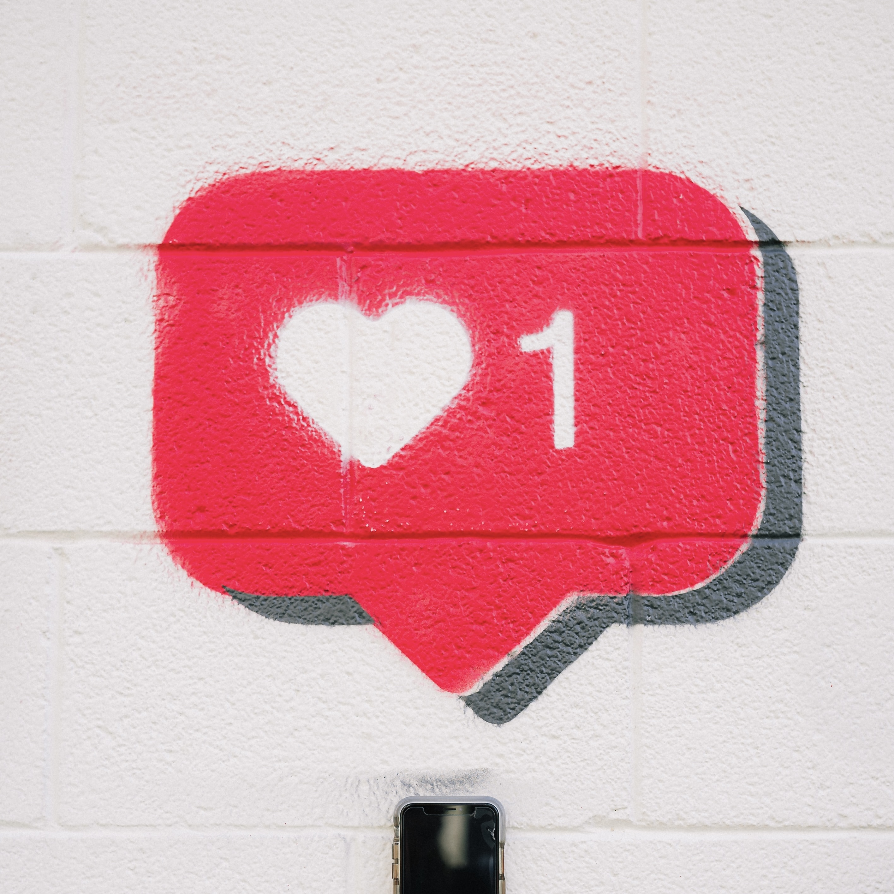

# Easy Feedback

**How do you signal appreciation?**

There has been a fair amount of debate recently about the utility of being able to “like” posts on social sites. Specifically, this has come up in the form of discussion around the photo sharing site, Glass, and their decision to eschew ways to “like” a post. Although likes are standard throughout social media sites, the idea to exclude them is not new. As I mentioned in [this post](https://frostedechoes.com/2021/08/19/a-picture-is.html), it’s one of the design principles that Glass follows that already existed on Micro.blog. 

## Low-cost appreciation

Some folks want an easy way of indicating enjoyment of a particular post. 

<blockquote class="quoteback" data-title="" data-author="Jason Becker" data-avatar="https://micro.blog/jsonbecker/avatar.jpg" cite="https://json.blog/2021/10/04/unpopular-opinion-in.html">
Unpopular opinion in the micro.blog (and maybe the broader indieweb community), but I agree <a href="https://birchtree.me/blog/i-think-glass-should-add-likes/">Glass, and other social systems</a>, should have likes. They can be private, and they don’t have to feed an algorithm. But I would love a low friction indication of being seen and appreciated.

<footer>Jason Becker <cite><a href="https://json.blog/2021/10/04/unpopular-opinion-in.html">https://json.blog/2021/10/04/unpopular-opinion-in.html</a></cite></footer></blockquote>

I have had the same thought. For example, if I post [a collage on Instagram](https://www.instagram.com/p/CBwYUD_jcq3), and it gets 14 likes (some from friends and family and some from total strangers that dig collages), it feels more rewarding than when I post it on my blog and I get no responses. 

However, are the likes from friends and family just obligatory and reflexive? It’s hard to be sure. The feedback isn’t three dimensional, it doesn’t have much weight and it’s low quality. There’s no indication of what the person likes about the post. It takes approximately one second to hit that heart button, so if people can do it while flying through a timeline, it can be difficult to know if they really spent any time looking at the post. 

## The shame of no responses

There are negative sides to even positive reinforcement mechanisms. What if no one responds to the post? It has been widely reported that teenage girls will [delete Instagram posts](https://www.theguardian.com/media/2015/nov/04/instagram-young-women-self-esteem-essena-oneill) when they don’t get enough likes within a certain time period. The absence of feedback can become a void.  A self-critical voice then fills the void. 

However, despite much being made of Instagram's negative effect on the mental health, we have to remember that much of the material from the studies that show this are based on [subjective self-reporting](https://unherd.com/2021/09/facebooks-bad-science/). 

## When even positive feedback is unwanted

In 2018, David Heinemeier Hanson, from Basecamp, wrote about how even [good feedback can be problematic](https://world.hey.com/dhh/your-likes-hearts-and-flattering-comments-are-bad-for-my-brain-649e9010).

> It’s the long-term exposure that does the harm. It’s the building of a tolerance. The cultivation of vanity. It’s not the first hit, but the forty-fifth.

> It was a week’s worth of abstinence from Twitter and Instagram that brought about this reflection. It felt liberating. Liberating not to play to a crowd with the power to instantly judge the performance. Liberating to be free from the likes, the hearts, and those flattering comments.

He discusses the cycle of getting habituated to likes and then craving them and constantly checking for signs of approval. Eventually, the impetus to write is to get positive reinforcement. It doesn’t have to be the case that authentic writing suffers for this, but most of the time, that would be the end result of reorienting your goals purely to satisfy your audience. 

One unwritten idea that buttresses Hanson’s post is that Basecamp’s blogging solution, Hey World, doesn’t have these problems. Although Hey World didn't exist when the post was originally published on Medium, it is clear that the thoughts expressed by Hanson in this post shaped the creation of Hey World. 

###### Source: Karsten Winegeart [on Unsplash](https://unsplash.com/photos/60GsdOMRFGc)

