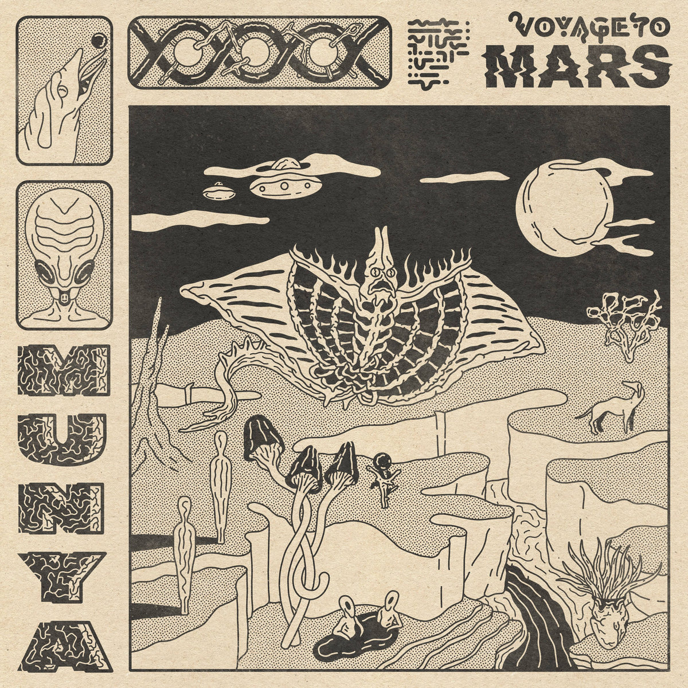

# MUNYA *Voyage to Mars*

<iframe style="border: 0; width: 100%; height: 120px;" src="https://bandcamp.com/EmbeddedPlayer/album=2539523620/size=large/bgcol=333333/linkcol=4ec5ec/tracklist=false/artwork=none/transparent=true/" seamless><a href="https://munya.bandcamp.com/album/voyage-to-mars">Voyage to Mars by MUNYA</a></iframe>

**MUNYA** is set to release her new LP, *Voyage to Mars*, in November. On tracks like, “Pour Toi” and “Cocoa Beach,” sounding much like fellow Quebecois, Men I Trust, she brings deep grooves and an impossibly smooth delivery. Sometimes, such as on "Boca Chica," she throws in a little tropicalia-tinged bachelor pad ambience. Think a little bit less space age than Juan Garcia Esquivel but just as breezy as Astrud Gilberto.   
{{more}}

The first song I heard from the album was the cover of the Smashing Pumpkins "Tonight, Tonight." My history with that song is complicated. I was a big Smashing Pumpkins fan after *Gish* came out and lost only a little of that enthusiasm when *Siamese Dream* made its debut. By the time *Mellon Collie* came out, though, and Corgan had insisted he wouldn’t play Lollapalooza if Pavement was on the bill, I started to realize the band wasn’t that cool. The bald dude stalking around the video for the rat in a cage song wasn’t even recognizable to me. The music didn’t feel similar to the stuff put out by the band I loved in high school. I went and sold all of my Smashing Pumpkins CD’s at the local CD Alley, eager to put the band behind me. 

Years and a brother obsessed with the band later, I started casually listening to SP again (I even kind of like some of their most recent work). I definitely have to admit that “Tonight, Tonight” is a beautiful song.  MUNYA’s rework of it fits her style, but retains all of the beauty of the original. The song is less sweeping, and there are no grand orchestral elements, but it’s anchored in a pop style that brings freshness to the track.
