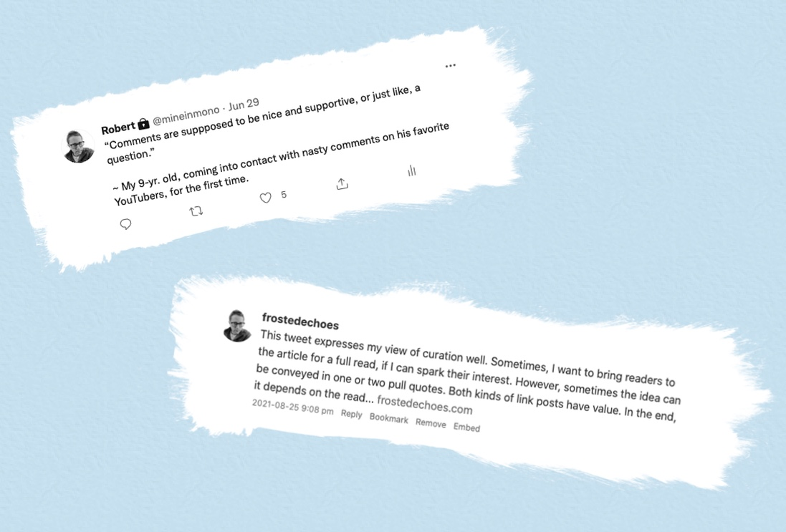

{|<} 

#  A Tweet As A Writing Prompt

There is something I love about taking, say, a tweet and freeing it from the forced obsolescence of the stream. Time marches on, as they say, but do the best ideas have to go with it? Embeds from services like Twitter, Instagram and Micro.blog can liberate great content from the shackles of an intrinsically ephemeral way of serving it up. 

{{more}}

## Embeds

Using embeds from other services in a blog post is also a great way to flesh out responses to thoughts and images that are kept perfunctory by the constraints of their platforms. The good blogging platforms have ways to incorporate those embeds into posts. 

1. Ghost has specific actions for some of the more popular services (YouTube, Twitter) and HTML blocks for using the embed iframe code from sites like Bandcamp or SoundCloud. 
2. Blot.im takes a naked tweet URL and automatically converts it to an embed.
3.  Micro.blog and the Hugo blogging engine upon which it is based can take any standard HTML embed code and also [offer shortcodes for popular services][4] (again, YouTube, Twitter). 
4. Medium uses a service called Embedly, which, while limited in terms of being able to customize the look of the embed, covers many services and is as easy to use as pasting a URL in the editor.  
5. Wordpress will also typically detect and embed from a standard URL and also has an HTML widget within the Gutenberg editor. 

Like social media, blogs also have a reverse chronological timeline, but allow thoughts more space to breath before the next one barges in.[^3]   Even though people describe their Instagram account as a “personal blog” in their bios, and bands [even announce breakups][1] via [Instagram posts][2], the posts rapidly get lost in the hustle and bustle of the service. They are there and then quickly gone. Those who keep a relentless watch on their social media feed are rewarded, but the rest of us can miss out. 

_Good ideas don’t have to be imprisoned by the tyranny of the timeline._

[1]: https://www.instagram.com/p/B4cv7SklRwq
[2]: https://www.instagram.com/p/CSZlrZJFqAz
[4]: https://gohugo.io/content-management/shortcodes/

[^3]: Reverse chron in the timeline for social media is no longer a given, although Twitter is now allowing users to choose this option. 