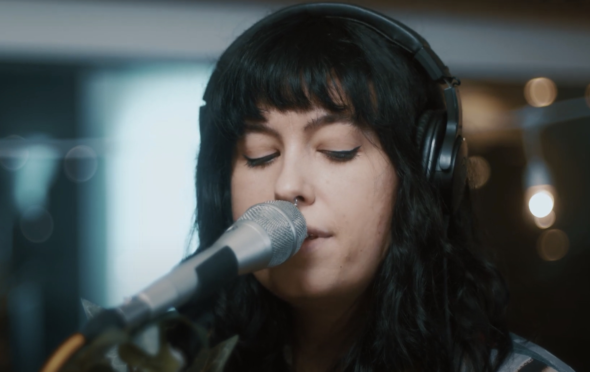

{|<}	

# Bathe Alone "Limbo"

Bathe Alone recently recorded a series of live videos at The Standard Electric Recorders Company. These kind of high fidelity, intimate live performances make for some of my favorite music videos. 

"Limbo" is one of the standout tracks on Bathe Aline's debut long player, *Last Looks*. Bathe Alone's Bailey Crone explains the dark meaning of the song in [an interview][1] about the sessions. 

> Crone says of the track, “Limbo is actually a super morbid song. The first line is “crawl out of the window, you don’t know where you’re walking”. I like how it sounds like a person crawled out of a window and literally started walking. But in my head, that person killed themself. Like they fell to their death. I hint at this in the second verse with “you faced your fear of falling”. I’m not sure if anyone would’ve picked up on this, but that’s what I love about writing a bit cryptic.

Despite the bleakness of the subject matter, the song is wrapped in a soothing haze, like a fuzzy blanket in the winter. 

https://youtu.be/3rGY2XPLB5U

[1]: https://www.undertheradarmag.com/news/premiere_bathe_alone_shares_new_video_for_limbo