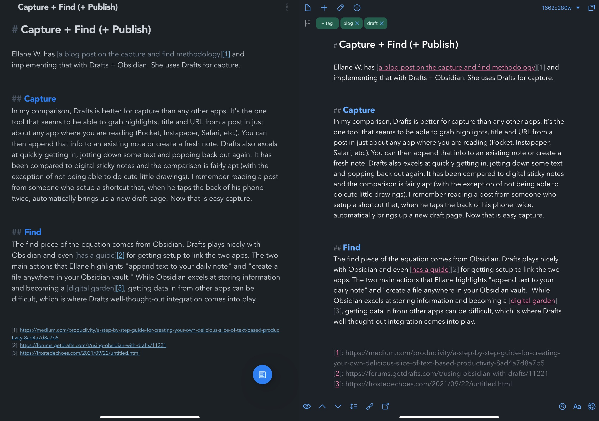

# Capture + Find (+ Publish)

Ellane W. has [a blog post on the capture and find methodology][1] and implementing that with Drafts + Obsidian. She uses Drafts for capture and Obsidian for find. It feels like there is something missing from her formula, though, and that is publish. With the process she lays out, there are a number of ways to fit publish into the workflow.  

{{more}}

## Capture  

In my comparison, Drafts is better for capture than any other apps. It's the one tool that seems to be able to grab highlights, title and URL from a post in just about any app where you are reading (Pocket, Instapaper, Safari, etc.). You can then append that info to an existing note or create a fresh note. Drafts also excels at quickly getting in, jotting down some text and popping back out again. It has been compared to digital sticky notes and the comparison is fairly apt (with the exception of not being able to do cute little drawings). I remember reading a post from someone who setup a shortcut that, when he taps the back of his phone twice, automatically brings up a new draft page. Now that is easy capture.  

## Find  

The find piece of the equation comes from Obsidian. Drafts plays nicely with Obsidian and even [has a guide][2] for getting setup to link the two apps. The two main actions that Ellane highlights "append text to your daily note" and "create a file anywhere in your Obsidian vault." While Obsidian excels at storing information and becoming a [digital garden][3], getting data in from other apps can be difficult, which is where Drafts well-thought-out integration comes into play.  

## Publish  

The one step that is important to me that was left out of the process is the step to publish. If you want to publish directly from Obsidian, you have only two options (that I am aware of). You can publish using Obsidian's own publish option. Or, if you are doing more traditional blogging, you can publish to [Blot.im][4] by sharing an Obsidian note to Dropbox. Blot also supports wiki style links, so it is really ideal if you are using Obsidian as the hub of your model. However, if you want to publish to other blogging engines, you have a couple of options. You can post straight from Drafts, which supports most services. In that case, you just change your posting action in Drafts not to default to "archive," once the post is made. You then use one of the actions to send to Obsidian and archive. In the case of a blog post, you would most likely use the action to send the note to an Obsidian folder.

The other way you can publish is to handoff the note to another app to take care of that piece of the process. For instance, you can share to iA Writer. If you are using Ulysses, you can hook up an external folder, which could be the one you use in Obsidian to store blog posts, and publish straight from there. The publish part of this process allows for the most flexibility and choice of tools. 

[1]: https://medium.com/produclivity/a-step-by-step-guide-for-creating-your-own-delicious-slice-of-text-based-productivity-8ad4a7d8a7b5
[2]: https://forums.getdrafts.com/t/using-obsidian-with-drafts/11221
[3]: https://frostedechoes.com/2021/09/22/untitled.html
[4]: https://blot.im