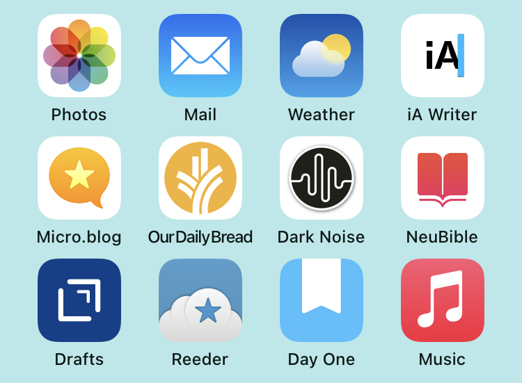

# The Tools Don't Matter?

I've heard it frequently said that the tools you use don't matter. That people who are constantly changing their working setups are just fiddling. It's an easy thought to entertain. I've seen many and instance where people spend more time *tweaking* their tools instead of *using* them. However, there's some evidence that optimizing and changing our tools can actually help us accomplish more.

Eleanor Konik [writes convincingly][1] about how Obsidian replaced video games and helped her publish. 

> Now and then I feel self-conscious about being so active in the community Discord because of stuff I see cross my dash periodically about “productivity porn” or about hoe “tools don’t matter” or whatever, and then I realize that no, actually, I’m genuinely — objectively, demonstrably — doing more things I love.

If you don't believe that can be the case Konik has plenty of her own stats to back up her claim. If you watch one of her demo videos of how she uses Obsidian, it's rather amazing the system she has put together and how it enables her to string together bits of knowledge. 

Sometimes, simply switching tools can actually make us more productive, at least for a time, simply due to the "novelty effect." Clive Thompson [discusses this in a blog post][2], with a focus on how switching word processors enabled him to get unstuck in order to write and edit more. 

> This is what’s so interesting about the novelty effect: It almost doesn’t matter what type of change you make to your work environment — just so long as you make a change. So long as it renders your work slightly askew, you get a novelty effect. (Trivia: Because the discovery was made at the Hawthorne factory, it’s also sometimes called “The Hawthorne Effect”.)

"The Hawthorne Effect" is not actually the effect of a novel working environment on an individual. Thompson is right in his description of the experiment with lighting changes that caused increased productivity. It wasn't the changes that caused the effect, though, but the understanding the participants had that [they were being observed][3]. People under observation tend to modify their behaviors based on their interpretation of the situation. Nevertheless, Thompson's anecdotal evidence is fairly convincing in suggesting that changing tools can boost our output. I have seen this personally, as well. When I want to use a new tool, I devote more time and energy into exploring it. As long as I maintain that excitement I initially have for putting the new tool through its paces, and testing its features, I am motivated to put in more effort and even creativity. 

I am still [using Obsidian][4] for notetaking and organizing my digital life. Everytime I come across a new capability, I'm more likely to spend time in the tool. I recently discovered the power of being able to tag individual lines in a note and how that differs from tagging a whole note and it opened up new possibilities for how I track ideas. 

[1]: https://eleanorkonik.com/obsidian-replaced-games-now-prolific/
[2]: https://clivethompson.medium.com/why-switching-to-a-different-word-processor-can-kickstart-your-writing-10329df7a300
[3]: https://en.wikipedia.org/wiki/Hawthorne_effect
[4]: https://blog.frostedechoes.com/tending-to-your-digital-garden