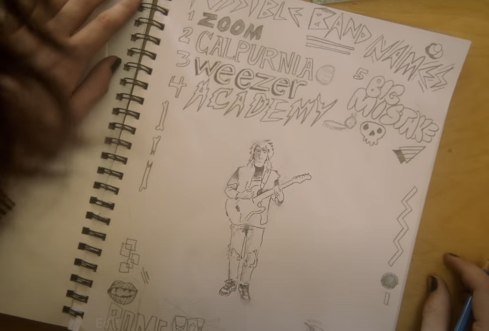

{|<} 

# Weezer “Take On Me”

On the Weezer appreciation scale, I’m at the end next to Leslie Jones’ character in the [infamous SNL dinner time fight skit](https://youtu.be/ab5WvwfLuLM). I appreciated the first two albums, went to see them on those tours and then they lost me after their return from hiatus.  However, I do consider them to be an amazing cover band. Their “Teal Album” of takes on the classics brings me joy. I especially like how the vocals are handled on “Take On Me.” 

{{more}}

The video stars Finn Wolfhard as a young Rivers Cuomo, rocking out in his living room. It’s chock full of clever 80’s nostalgia and also manages to fit in a proper homage to the animation from the original video. 

https://youtu.be/f7RwDnZI7Tw