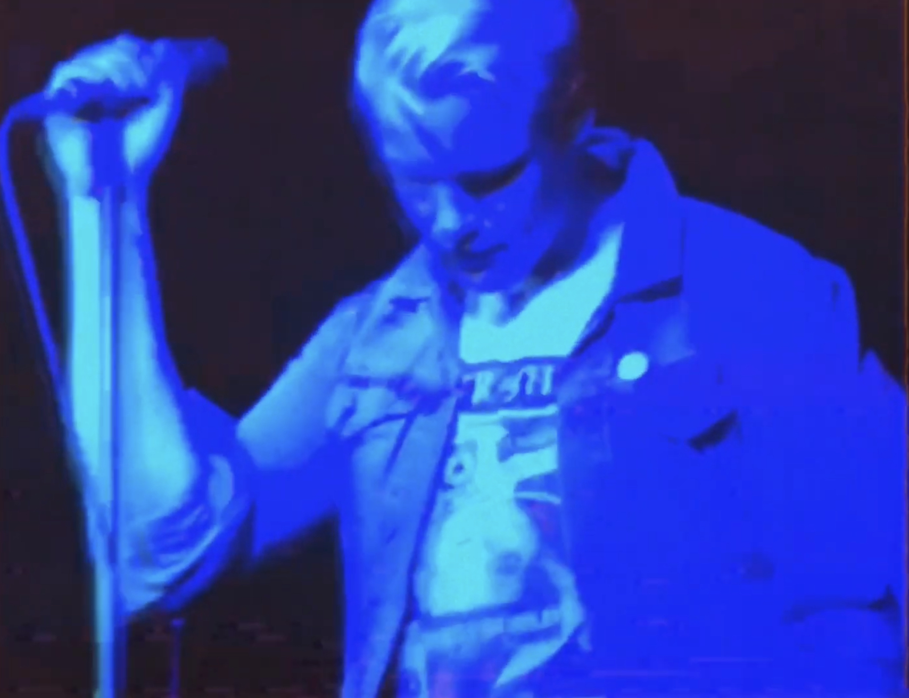

# Spectres "Northern Towns"

For this Friday Night Video, Spectres comes your way with some powerful, muscular post-punk. At first, I thought this was a fan-made video with the traditional fuzzy retro found footage. It wasn’t until the band was shown in the same style that I realized it was a legit official video for the song. This one has been in heavy rotation as part of my _The Noise That I Loved Best 2021_ playlist.

When my son heard this song, he asked if it was Joy Division. It is certainly indebted to the Factory Records sound. While this track sounds inspired by Joy Division, another single, “Tell Me,” sounds more like New Order. It’s clear where Spectres influences lie. You just have to go back to Manchester about four decades ago.

https://youtu.be/ODqZBktiyWs