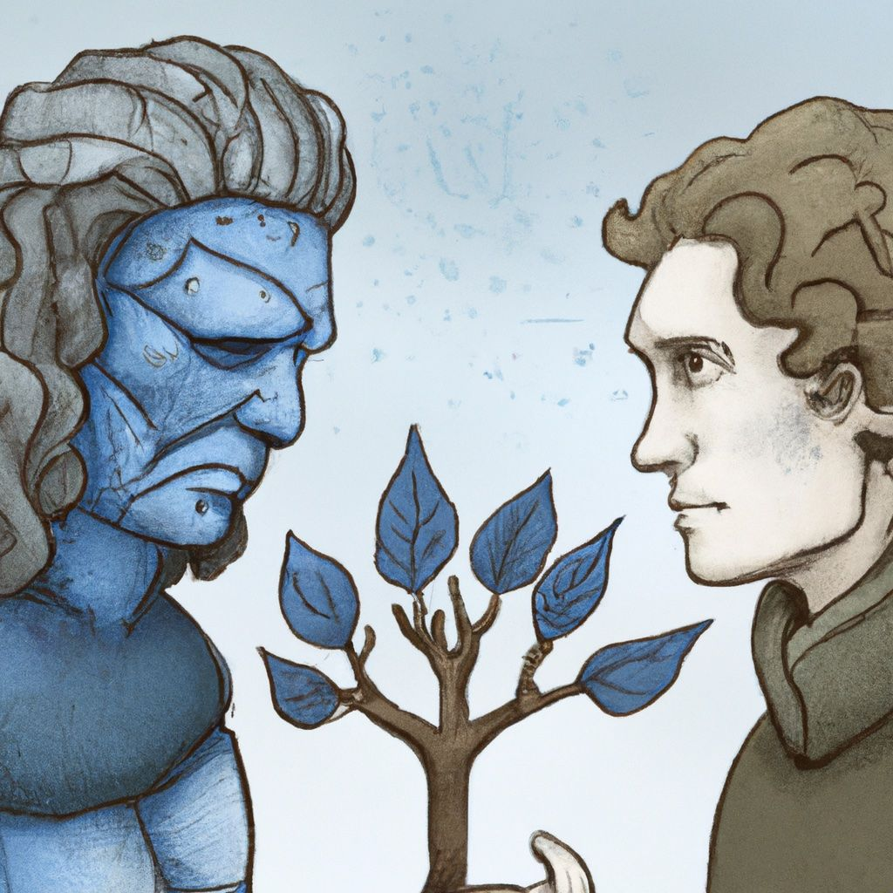

# Sophists and Frost Giants

{{entry.metadata.summary}}

<blockquote class="quoteback" darkmode="yes" data-title="" data-author="Rogers Cadenhead" data-avatar="https://micro.blog/rcade/avatar.jpg" cite="https://rcade.micro.blog/2022/09/05/i-never-stop.html">
I never stop wanting to love the New York Times and they never stop stopping me by publishing dopes like Ross Douthat, David Brooks and Maureen Dowd.

<footer>Rogers Cadenhead <cite><a href="https://rcade.micro.blog/2022/09/05/i-never-stop.html" class="u-in-reply-to">https://rcade.micro.blog/2022/09/05/i-never-stop.html</a></cite></footer></blockquote>

We typically don't want to hear from those with whom we disagree. I use the word "we" very deliberately because I'm just as guilty as anyone else. I'm likely to rage-quit a publication or even a whole network after encountering too many views that don't jive with mine. Encountering opposing views is necessary, though. We should encounter different opinions in the same publication — and not just to get us out of our echo chambers.

{{more}}

Publications should feature different voices because it's the only way they can engender widespread trust. I've [been critical of Ross Douthat in the past][1], but frankly, the New York Times needs the views of someone like Douthat. Without the people named in the above post, the publication risks becoming a monoculture.[^1]

{|<}  

Why has trust in journalistic institutions dropped so much in the past few decades? People don't trust them because their reporting has become one-sided and normative. Andrey Mir [calls this post-journalism][2]. People realize when they are not just reading news reports, but spin in favor of the publication's preferred ideology. I can't take reporting on hot button issues from Fox News or NPR at face value because I know they've got an agenda. 

By including a variety of opinions, the NYT insulates itself from at least some of that criticism. They aren't shy about admitting this, and as long as they give voice to different perspectives, their claim will have credibility. The message that they post at the end of opinion columns by writers like David Brooks says it clearly.

> The Times is committed to publishing a diversity of letters to the editor. We’d like to hear what you think about this or any of our articles. 

It may sometimes be a bitter pill to swallow, but I'm coming to the understanding that we need to hear from all different kinds of people. 
 

[^1]:	Some, of course, would argue that the NYT already is a monoculture, but the discomfort in the post is evidence against that view. 

[1]:	https://frostedechoes.com/2019/04/19/doctrine-and-grace.html
[2]:	https://frostedechoes.com/2022/06/07/breaking-news.html