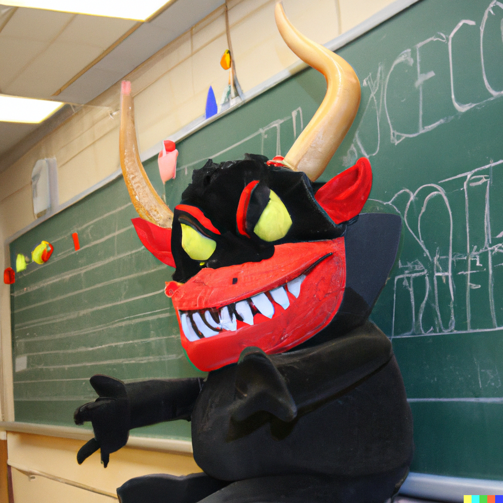

# The Demon Of Intellectual Diversity

I was planning on reading the two books by author Phil Christman, but he lost my interest after [his latest Substack rant](https://philipchristman.substack.com/p/a-cul-de-sac). I'm not sure what it's going to take to make people like Christman, who consider themselves progressive, realize that some parents don't want their children to learn sexual morality in school. Christman and others can hurl all of the insults they can think of, accuse these people of being pathological, having maggots for brains or being demons or whatever, but it's probably not going to win anyone over or solve anything. 

{{more}}

Here's Christman talking about a [parent at a school board meeting who objected to a mural](https://www.today.com/parents/parents/mural-painted-student-grant-michigan-sparks-controversy-rcna52243) at the school health center that depicted three symbols advocating alternative gender and sexual ideology. 

> This, on the contrary, is the voice of a stupidity so profound that it could only be chosen. This person had to work at it, and has to know, on some level, that she or he is playing an Alternate Reality Game. It’s a stupidity so defiant that it evokes an answering stupidity in me. That stupidity says something like: Give up. Writing books is irrelevant. Teaching writing is irrelevant. Democracy is irrelevant. To Real America, every contribution you try to make to the functioning of society is irrelevant or sinister. Democracy was a mistake. Retreat from the world. Cultivate idiocy in the classical sense and start prepping for the civil war, or the civilizational downfall that Real Americans will bring upon all of us. You can’t fight fate.

It's tough to even follow any logic in this rant, but in other words, these parents are driving the author batshark crazy. Promoting sexuality in schools is absolutely a hill he is willing to die on. For what reason, I'm not exactly sure. 

Unfortunately, in this scenario, the student who created the mural had to face the backlash. The adults who approved the student's mural had to have known that would invoke the ire of parents who don't want their kids to be exposed to alternative sexual and gender ideology. They went ahead and approved the mural anyway, putting the poor young woman who created the mural in the cross-hairs of angry parents. 

