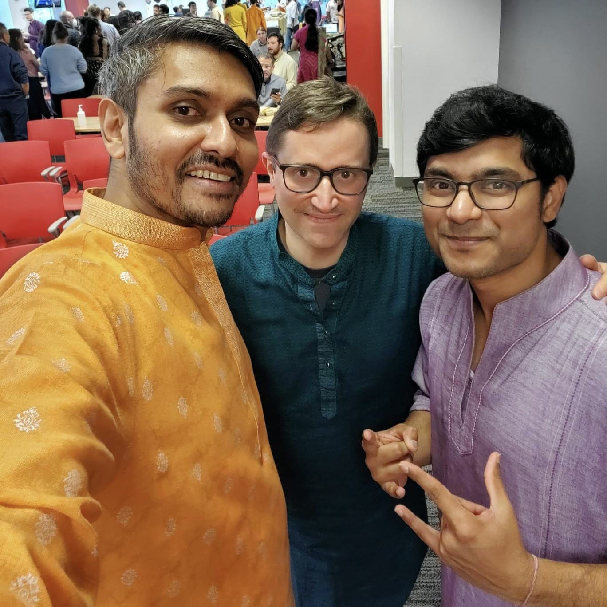

# Week on the Web October 29, 2022

Hey there, welcome to another Week on the Web post. It's the festival season in India, and we observed the season by kicking things off with a Diwali celebration at the office. As always, it did not disappoint. Although I'm more limited in what I can eat these days (after swearing of gluten and diary), I still found some good, spicy food to nosh on. 

Politics are heating up this time of year, and this has to be the toughest election — in my lifetime — to vote in. The candidates are extreme in their views, right and left. I've written a little bit about this for this weekend's digest. 

{{more}}

---

Amit Gawande writes about having lost something when Apple killed the iPod. When you can have everything, everything has less value.

> Sure, I could still fall back to my music-listening style of yesteryears with my smartphone. But the "smartness" of the device already hinders any semblance of focus that the one-purpose iPod allowed. I also understand that there are a lot of positives to streaming services. The discovery of new music and artist is one big plus. But what is a discovery worth if I don't feel the emotion behind it?

I fantasize about going back to the click wheel iPod, loading it up and going to classes at NCSU. Its screen was a delight, its interface and minimal and pragmatic. I loved it. There were edges where now there are none. We're living a dream come true with the celestial jukebox, but we can't help but feel nostalgic. 

→ [iPod died, and so did my habits with music | Slanting Nib](https://essays.amitgawande.com/ipod-music-habits/)

---

Stephan Ango, who created the excellent new default Obsidian theme for the 1.0 launch (as well as the Minimal theme) writes about how text manipulation tools are in their infancy. Ango envisions that there will be much more we can do with text, in the same way that we can do so much with photos now. 

 > Today there are useful tools that build on spellcheckers to help you improve clarity, grammar, tone — but these are rudimentary compared to the new capabilities that are being developed. Text filters will allow you to paraphrase text, so that you can switch easily between styles of prose: literary, technical, journalistic, legal, and more. You will be able to easily change an entire story chapter from first person to third person narration, or transform narrative descriptions into dialogue.
 
It's an exciting time to be a digital packrat who likes to capture and share. 

→ [Photoshop For Text | Stephan Ango](https://stephanango.com/photoshop-for-text)

