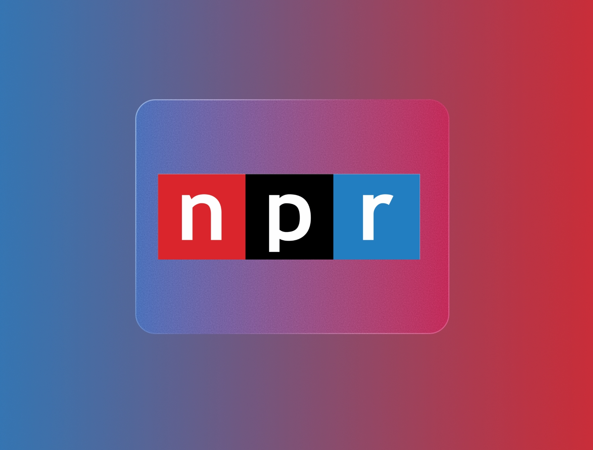

# You're Only Getting Part Of The Story

I have been writing a fair amount about bias in journalism and how it's leading to more polarization. [One such piece](https://frostedechoes.net/sophists-and-frost-giants/) received a comment about how NPR had the most journalistic integrity out of the organizations I singled out. In terms of bias, I don't think NPR is the worst offender, but I can see clearly that the organization's view of the world shapes what it reports on and how those things are reported. I included NPR and Fox News in the same sentence on bias, and perhaps that was a bit unfair. After all, my wife and I are sustainers of our local NPR affiliate, WUNC, and I would certainly never say the same of an organization like Fox News (even if it was using a publicly sustained model).  

After getting pushback about the comparison between the two very different news outlets, I thought about expanding my thoughts on the subject to illuminate where I see some similarities. I'll leave Fox News alone because I'm not really that familiar with them, at this point, but I've seen enough to know that their intentions are evident to most clear-thinking people. Despite "fair and balanced" being a previous slogan of Fox News, I don't think they get even close to approaching either. They've proven time and time again that they have a strong bias towards Republicans. I deliberately say Republicans and not conservatives because much of what comes out of the Republican Party these days bears no resemblance to traditional conservatism. Where the road splits, Fox follows the Republicans. If that includes giving airtime to baseless conspiracy theories or political insurrection, then that is where they happily go. It's not for nothing that they are being sued by Dominion, the maker of voting machines — [and losing key verdicts in the case](https://www.cnn.com/2021/12/16/media/fox-news-court-dominion/index.html) — for deliberately spreading lies about the company. I think the argument against Fox News fairness has been thoroughly made by the obviousness of their reporting slant.

---- 

### The Bias At NPR

The basic problem I have with NPR is that they project an air of objectivity, and I think a lot of people buy into that marketing. They do this while pandering to the left to sustain the kind of emotion that drives people to subscribe to their programming. This is the [post-journalism model](https://human-as-media.com/2022/05/01/disinformation-is-no-danger-fear-polarization/). You need sustaining subscribers to keep your organization afloat and you do that by honing in on a niche but making that niche feel like it is the mainstream. In post-journalism, you advocate for your side of the story, rather than presenting both sides. Presenting another side of the story risks alienating your subscribers, thus endangering your source of income. 

I was thinking about the best way to illustrate the bias at organizations like NPR when I came across [this digest post](https://intellectualoid.com/about/) from Reader John. In it, the blogger poses an interesting thought experiment about political extremes.

> Q: If the press labels someone “far right,” can you trust them?

> A: No. The press does that regularly to move the Overton Window leftward, consciously or unconsciously.

> Q: If the press labels someone “far left,” can you trust them?

> A: I think so, because …

> Q: Ha! Ha! Ha! Ha! Ha! Trick question. The press never calls anyone “far left.” 

As they say, it's funny because it's true. Substitute "the press" with "NPR" and you have a match. I wasn't content to simply let this sort of humor get by without any empirical evidence, though. I actually did some searches on NPR.org to find out if the premise of the joke, which is so easy to accept, has validity. I already knew that you couldn't swing a dead cat without hitting an article about the far-right on NPR.[^1] All I had to do there was take a screenshot of the day's homepage. 

Just to make sure I was on the right track, though, I also did a search for "far right" on the site. There were multiple results just from the past few days. When I searched for "far left," the stories were much fewer and farther spread apart. The only time I could see the phrase "far left" used in an editorial way was in articles about France. Apparently, that's the only place the far-left exists. Well, that and in the minds of those on the far-right. The other places that the phrase was to be found was in quotes from right-wing politicians.[^2] 

Why is it that NPR thinks there is a far-right so immanent and so close that it needs constant tracking and reporting but doesn't acknowledge the far-left in any real way? To report on the far-left would risk losing subscription revenue that the organization counts on. It's much easier to play into their left-learning supporters biases and fears. 

### What Does The Far-Left Look Like?

You may be thinking, _that's great, but the reason NPR doesn't report on the far-left is that it's not really a thing in any significant way_. So what does the far-left look like? A good example would be an organization like "Jane's Revenge," that came out of the woodworks after the Supreme Court's decision in the Dobbs case. [Jane's Revenge](https://en.wikipedia.org/wiki/Jane%27s_Revenge) is a militant extremist group that is strongly pro-abortion. They claimed to have committed — or were suspected to be involved with — nearly twenty acts of terrorism and/or vandalism across the U.S. in just 3 months this year, after the Supreme Court case. They firebombed pregnancy centers and sent people death threats. Many news organizations, including Axios, The Guardian and the Washington Post, reported on these events. These publications are hardly bastions of conservative thought. If you're with me so far, you can probably guess how many of these events could be discovered on NPR.org. A big, fat goose-egg. 

Reporting on abortion activists committed acts of destruction would go against the narrative that NPR is, quite literally, selling to their followers. The narrative is that abortion activists are only out for human flourishing, bodily autonomy and individual rights. To even imply that there are dangerous elements in the movement would offset their own activism with regards to the subject. So, they just don't mention it, much to the relief and comfort of most of their listeners, who have bought into the NPR worldview. 

### Sex Education

As a listener, I know what NPR are going to report on and how they are going to report it. It's not that I have a crystal ball, it's that I've listened and read enough to be familiar with their ethos and that they maintain a consistency about what is worthy of exposure and how those topics should be handled. Take, for example, [this piece on how sex education should be taught](https://text.npr.org/1121999705). NPR follows the progressive narrative that sexual identity should be a primary concern for most people, and favors bringing children into this worldview as soon as possible. The article points out some common-sense actions, such as teaching about boundaries early. Of course, this kind of instruction has been going on for some time and would hardly merit a lengthy article.  

> And middle school is a good time to start learning about gender expression and sexual orientation, as well as gender stereotypes. One Advocates for Youth lesson includes a scavenger hunt homework assignment where students look for gender stereotypes in the world around them, like a sports ad that only features men or an ad for cleaning supplies that only features women.

The statement is made as if it's uncontroversial. However, it has always been the case in my lifetime that schools require parent's permission just to teach about the basics of sex, to say nothing of gender expression and sexual orientation. So, clearly, the statement is not an incontrovertible fact, as it's presented. The article goes further than that to establish normative boundaries around the subject, though. 

> "Even though it may seem like sex education is controversial, it absolutely is not," says Nora Gelperin, director of sex education and training at Advocates for Youth — an organization that promotes access to comprehensive sex education.

The article's clear intent is to make it seem like no one disagrees with a very progressive view of sexual education for children. Do the authors quote anyone who might have a problem with the statements from this side? They do not. I would guess, though, that probably the majority of parents would take issue with at least a few of the points in this article. Sure, most of us dutifully sign those permission slips when the time comes to teach about the birds and the bees. Were they to begin in kindergarten, though, I would have reason to pause, at the very least. I would also be suspicious about the middle school teaching what gender roles should and should not be, which is more sociology than sex education. 

The authors claim that the science backs up the push for earlier sex education. They cite a research study to support this claim. They say that students who take what they are calling "age-appropriate, comprehensive sex-education" (they are the ones defining the use of the term "appropriate," which has a striking dishonesty to it) — have improved outcomes. If you read the results of the study cited, one of the improved outcomes the study lists is "appreciation of sexual diversity." That's a normative claim, _not a scientific one_. In fact, most of the outcomes listed are normative and only apply if you follow their prescribed worldview. It would be hard to get into a whole discussion about epistemology for this blog post, but suffice it to say that the authors are making a circular argument that you can only agree with if you already agree with their perspective and the premises they have set. It's like saying, "teaching kids about our worldview allows them to have a greater appreciation for the things that we think are important." There is very little that is scientific about that. 

I'm not arguing that the goals of the sex education program presented are wrong. I understand that kids of a certain age need to understand subjects like sexual diversity. However, the topics taught and the age at which they are to be learned are contentious, and should be subject to good faith discussion. NPR would have you believe otherwise.

### The Religion Of NPR

One thing that is evident to anyone of religious faith is that NPR doesn't have a lot of expertise in that area. [I wrote about one article](https://frostedechoes.net/orthodox-christianity-the-far-right-and-the-green-eyed-christ/) that seemed to implicate the Orthodox Church in collusion with far-right extremists and only later found out, from someone with first-hand knowledge, just how skewed and deficient that piece was. That's just one example. Another example [is a piece that was linked to](https://www.npr.org/2022/09/25/1124101216/trans-religious-leaders-say-scripture-should-inspire-inclusive-congregations) by a fellow microblogger about transgender religious leaders and scriptural interpretation. The faults here are much like those of the article on sex education. While you would expect the article on sex education to appeal to science or studies on the subject (which it doesn't), you would expect an article on Christian scripture to appeal to scripture. It doesn't quote any passages of scripture, though. 

Again, NPR disappoints by only presenting one side of the discussion. Since I attend a very affirming church — PC(USA) — that allows people with non-traditional sexual orientations or gender identities to take communion, be married or be ordained, I get that side. I understand some arguments made in the piece. The correction of the misconception about the purpose of the Sodom and Gomorrah, for instance, is spot on. That story is not a condemnation of same gender sexual behavior, but really a lesson in how we treat strangers and foreigners and hospitality (read Ezekiel if you doubt). However, the article intentionally and openly skimps on someone who might hold another interpretation of Christian teachings. 

> Evangelical Christianity has played a big role in the political debate around transgender issues, and the spate of legislation it's led to. And so that position is widely known: God created humans, separated into male and female – categories that are innate and immutable.

That's all the space the author is willing to give to alternative viewpoints. I'm pretty sure you can find theologians whose view is not that Christian scripture has found its ultimate expression in Butlerian gender ideology, but the author is not interested in that because, "that position is widely known." Insofar as we are assumed to have heard that side of the story, it's not included and not defended by someone who might have more scriptural knowledge than the individual writing the piece. 

### Erosion of Trust

All of these examples speak to why there is an erosion of trust in journalistic organizations like NPR. They can't be counted on to tell the full story when they are articulating only one side of the debate. Their reporting can seem like it's trying to propagandize for whatever the progressive argument is on a given topic. It may seem fair, unless you know something about the subject being discussed. 

When you have seen and heard enough stories to recognize the inherent bias, you can't trust the rest, where you might not be as familiar with the subject. Are they giving time to opposing views? Are they just articulating for one side of a complex issue? Are they ignoring nuance in favor of a clear, definable narrative? These are just some of the questions that you find yourself asking when doubt creeps in. I wouldn't counsel anyone not to listen to NPR, but to understand that when you do, you are only getting the part of the story that they want to tell you.

---- 

_I realize there is irony in the fact that I'm writing this as my wife sits downstairs in a NPR hoodie, but I'm willing to live in that tension. _
 

[^1]:	Sorry, I love cats, don't @ me!

[^2]:	Call this lazy empiricism, if you want, but I haven't done real research in a long time.