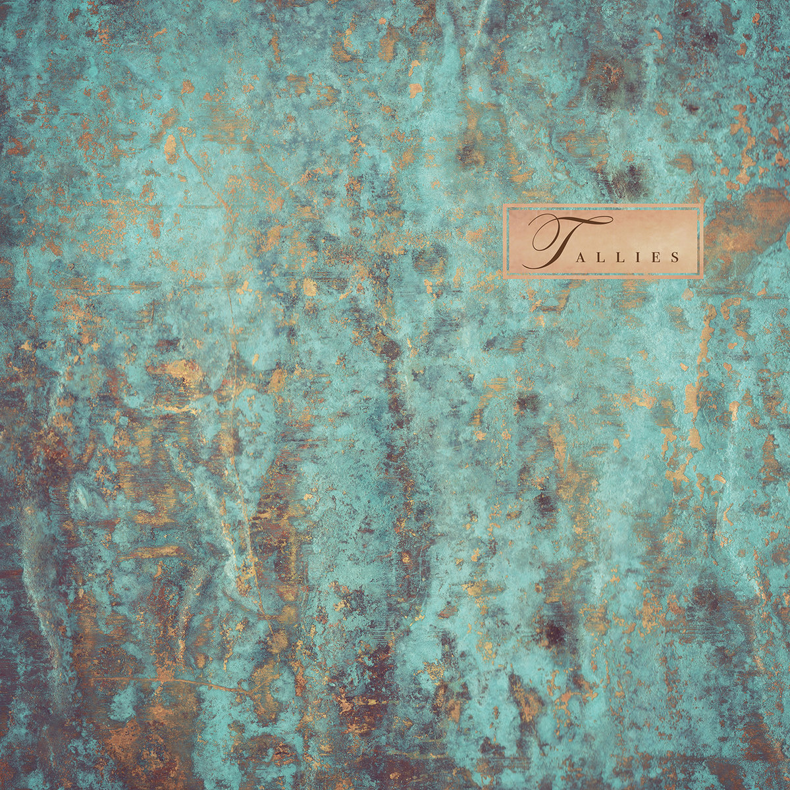

# Patina

One band that Apple Music introduced to me this year in my Friday New Music playlist was Tallies. I was immediately smitten with the indie pop and shoegaze mixture in "No Dreams of Fayres." It wasn't until later on the year, though, that I read the band mentioned elsewhere and decided to dive deeper into their catalog. 

This year's release, *Patina*, was included in [Adam Wood's review in his year-end top 20 albums](https://blog.zioibi.com/list2022) from 2022. 

> Toronto four-piece Tallies were new to me this year, and had I encountered this record divorced of context I likely would have suspected it was from somewhere in the early or mid-90s. (The cover even seems to be a nod to 4AD output from the era, like Pixies, Belly, & Red House Painters.) Lightly-treated vocals across beds of layered, fuzzed guitars — it has the feel of vintage dream-pop, a sound that either had a resurgence this year, or which I became enamoured of in a new way. I have had flirtations before with artists like Beach House and Grizzly Bear, but Patina perhaps brings something to the mix that was missing for me: a sense of lightness, and maybe a poppier tint.

Plenty of bands have made the 4AD sound and aesthetic their working template, but not all of them are worth mentioning. I once read a review that harshly said something along the lines of, "this band is more of a pale imitation than Pale Saints" (ouch). Tallies doesn't exactly break the mold, but they are interesting in their own right. They also manage to take the formula to new heights on songs like "Catapult," which features a soaring chorus with a tinge of wistful regret. My son is in love with the Cocteau Twins record *Heaven of Las Vegas*, and I would have no problem recommending *Patina* to him.[^1]

•••

The video for "No Dreams of Fayres" isn't super high concept for a dreampop song, but it has all of the right textures, with a dirty Super 8 film grit and plenty of gratuitous light leaks. 

[https://youtu.be/p5RCWvkCivs](https://youtu.be/p5RCWvkCivs)

[^1]:	Maybe one day he will read recommendations straight from my blog.