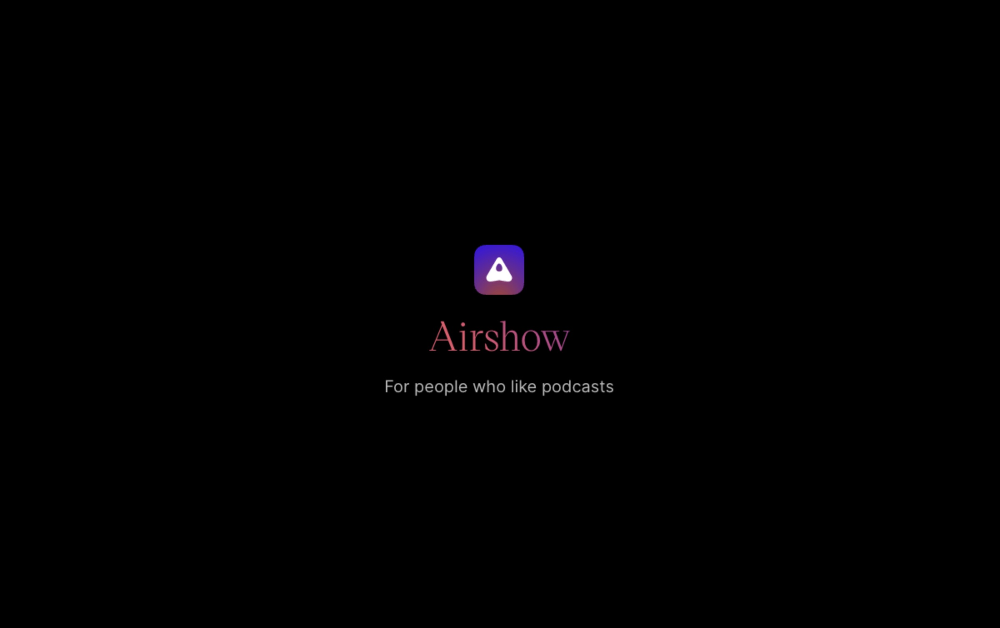
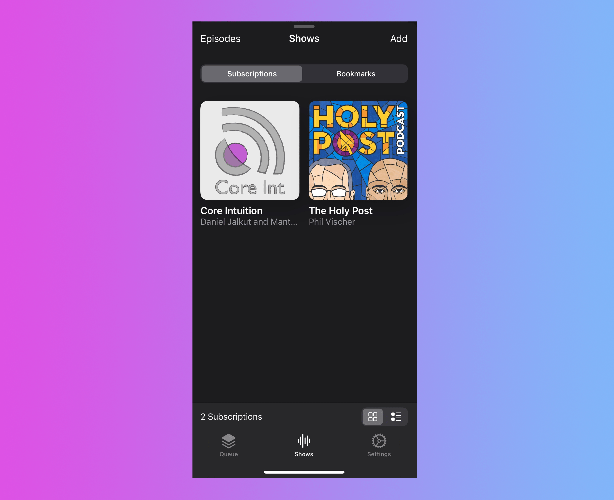

# Airshow

I consider myself fortunate to have procured a subscription to the [feed reader platform Feedbin](https://feedbin.com), when it first launched, after the untimely demise of Google Reader. Getting in early allowed me to lock into the service at $2 a month. Feedbin has been improving over the years, adding features that make it more of a one-stop-shop for keeping up with the things you follow on the internet. Many times, I even view most of my Twitter feed using the app because I would rather not venture into the stream. 

One of the uses I've had for Feedbin has been listening to podcasts, for which the web app has a nice built-in player. It reminds me of the old days, when Mac feed readers like Newsfire had podcast features. After all, podcasts are just RSS enclosures, so they make sense in your favorite feed reading software. However, that doesn't help much when you want to take your podcasts on the road. Enter [Airshow](https://feedbin.com/airshow). The new podcast app from Feedbin syncs with your podcast subscriptions and has just enough functionality to be a delight. It's a breath of fresh air (no pun intended) after using some other, ahem, "official" podcast apps. 

Airshow mainly relies on a queue for management. You download new episodes, and they get added to your queue. _Simple_. However, I think my favorite thing about the app, and the differentiator, is that you can add shows either as subscriptions or bookmarks. Subscriptions are shows that you want automatically downloaded when new episodes arrive. Bookmarks are shows that you check out occasionally, and may not choose to download every episode. Other podcast apps allow you to make similar choice, but none present the binary so elegantly. 

I've found Airshow to have much more reliable synchronization than Apple's Podcast app. In fact, you can watch the timeline scrubber synchronize in real-time. Airshow was built to "add value to your Feedbin subscription" and it does exactly that. 
