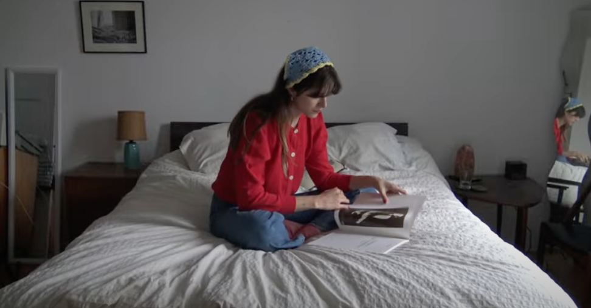

# Marci 

Bandcamp has [a review of the debut album](https://daily.bandcamp.com/album-of-the-day/marci-marci-review) by Marci, AKA Marta Cikojevic, who plays keyboards in the band TOPS. 

> The album summons the spirit of the ‘80s, at various points recalling Tears for Fears, Sade, and Pretenders with its dreamy vocals and fuzzy synth lines. But Marci remains distinctly contemporary, and slots nearly alongside similar albums by artists like Caroline Rose or Shura: distinctly danceable, quietly emotional, and wrapped up in jubilant confidence. A triumphant debut, Marci takes hold of the senses, summoning the slick rub of skin on a dark dance floor, the tingle of ocean salt spray, or the laughter of your closest friends coming from the next room.  

I wrote about the song "Terminal," a disco-inflected jam by Marci [a couple of months ago](https://frostedechoes.com/2022/06/10/terminal.html). Now that I've heard the whole full length (a few times now, if that tells you anything), I can see influences from the early 80's as well as the heyday of disco. Both "Immaterial Girl" and "BB I Would Die" bring to mind early solo Michael Jackson. The latter has a "The Girl Is Mine" vibe — until it comes to the chorus — that makes you wonder if Paul McCartney is going to come in with vocals at some point. Cikojevic's voice on "Call Of The Wild" brings to mind Caroline Polachek. Influences show up all over this record, but it's also got a distinctiveness to it. I'm glad to hear Cikojevic step out from behind the keyboards and project her own persona. 

<iframe style="border: 0; width: 100%; height: 120px;" src="https://bandcamp.com/EmbeddedPlayer/album=2614834499/size=large/bgcol=333333/linkcol=ffffff/tracklist=false/artwork=small/transparent=true/" seamless><a href="https://marciii.bandcamp.com/album/marci">Marci by Marci</a></iframe>

*Favorite track: Terminal*
