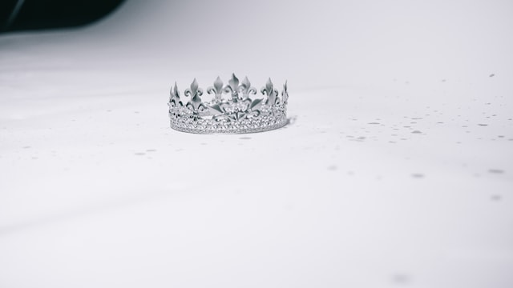

# The Crown

I completely understand why my wife and others have no use for the British monarchy. For one thing, my wife is Irish, so amicable feelings for the royals in England does not come naturally. For another, obviously the concept of monarchy and someone who lives in luxury to be a sort of figurehead flies in the face of our shared sensibilities about good stewardship and distributing wealth equitably. 

{{more}}

Yet, despite my sympathy towards those who cannot rouse themselves to celebrate the trappings of a antiquated institution, I can't help but feel a sort of sadness at the passing of Queen Elizabeth. It is something more than just a reluctance to see the symbol of another age disappear. Maybe I watched too many episodes of *The Crown* on Netflix, but the Queen represented a Britain that seems aspirational — like the dreams of the most ardent Anglophile embodied.[^2]

Paul Kingsnorth [writes about][1] how, during the decline of Britain in the modern era, Elizabeth stood out as a reminder of the spirit of the country. 

> The Queen lasted: nothing else did. As Aris Rousinoss wrote this week, Britain’s decline in my lifetime - from a country which ran much of the world to a country which can barely run itself - has perhaps been unprecedented in modern history. Come up with whatever diagnoses you please, blame who you like, but you can’t deny the downward trajectory: steep, dizzying, painful. Only the Queen stood still, or seemed to, and as she did so she represented something much older than any of the rules we live by. A monarch has sat on the throne of England for 1500 years. The meaning of this is mostly inaccessible to our argumentative modern minds.

Kingsnorth doesn't ignore the question of why Britain would have a monarch in these times. 

> What, after all, is the point of a monarch in the modern world? There is really only one: to represent a country and its history; to be a living embodiment of the spirit of a people. As such, the throne represents to its critics more than some putative offence against ‘democracy’: it stands for something whose very existence is increasingly contentious in its meaning, form and direction: the nation itself.

It is true that we have trouble conceptualizing the idea of a sovereign ruler with little actual power as a stand in for the nation. It could be that we've evolved past such archaic concepts or it could be a deficiency in our imaginations. 

[1]: https://paulkingsnorth.substack.com/p/the-nation-and-the-grid?publication_id=250836

[^2]: Admittedly, I did stop watching *The Crown* when Claire Foy was no longer playing Her Majesty. 