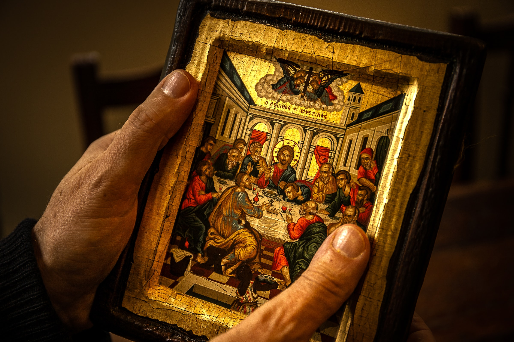

# The Power of Ceremony

Anna Havron argues for the power of ceremony and ritual to change our mindset and behaviors in [this piece](https://www.annahavron.com/blog/use-a-ceremonial-object-to-change-your-behavior). Those of us who attend liturgical churches will recognize what she is referencing when she contrasts the effective versus the efficient. 

> Ceremonial objects transform your experience. This is why old churches use candles and incense (effective) rather than fluorescent lights and Febreze (efficient). 

Taking things a bit further, the traditions that are described as "high church" take it for granted that the surroundings in which you worship transform the act of worship. 

> And this is why aesthetics and design matter so much. How a room is furnished and decorated can literally change your thinking. The objects you use, can literally change your experience. 

Whenever I speak to clergy at an Orthodox Christian Church, they emphasize the power of [invoking the five senses](https://blogs.depaul.edu/dmm/2013/01/22/the-five-senses-in-worship/) in the worship experience. Incense is a part of the liturgy, not just because the early Christians used it in the catacombs, but also because it [conditions you](https://youtu.be/LyDWkTX6Ops) to associate the scent with stilling your mind and focusing on God. In the Antiochian Orthodox Church, hymns are chanted, without instrumentation, so that the focus is not on the music or the performers but on directing your attention toward God through sound. Every Divine Liturgy service features partaking in communion so that the power of taste invokes a form of divine reverence that goes back to the beginning and the ritual that Jesus established to remember Him. Touch is engaged in the worship experience through the veneration of icons, making the sign of the cross, and prostrations. The labor of worship is physical. Last but certainly not least, the surroundings accustom your sight to things that are holy and worthy of contemplation. Icons and depictions of miraculous scenes (like the Transfiguration on Mount Tabor) remind us of the holy. 

([Image source](https://unsplash.com/photos/soCy6vgnGmg))