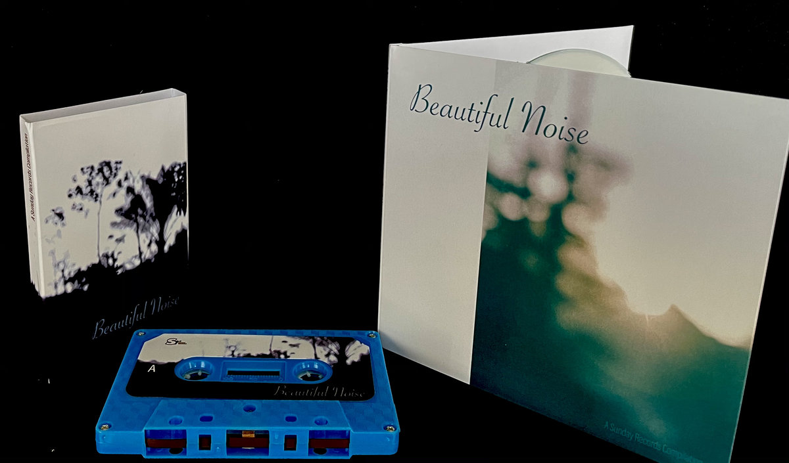

# Encase My Heart In Amber (or at least plastic)

**Beautiful Noise**. A simple title to a record label compilation, but a more accurate descriptor could not have been employed. *Beautiful Noise* from Sunday Records is just that, slices of mostly synthetic instrumental dream pop that are as ethereal and gorgeous as any your imagination could conjure. Almost every song is uniquely transportational, taking the listener to a different liminal space, but the pervading aesthetic fuses the parts together as a magnificent whole. By the time the drums pads hit on the second track, “Million Years” by Mariana In Our Heads, you will likely be someplace else entirely.

The Bandcamp page for the compilation describes its conception. 

> There are too few genuine musical labours of love out there, but it's clear this is one. It seems fitting it was a project first dreamt up by Sunday Records boss, Albert, right back at the beginning of the label in the early 90s and here it finally comes to fruition. As well as cd and download the existence of a cassette may feel like a hipster affectation but actually fits for what feels like a lovingly put together old school mixtape, if only it came in a hand crayoned cover..

Some of these bands don’t even have full length albums out. Hopefully this little collection will whet your appetite for more from the contributors,in the future, as we close out this wretched year. 

<iframe style="border: 0; width: 100%; height: 120px;" src="https://bandcamp.com/EmbeddedPlayer/album=2604526358/size=large/bgcol=333333/linkcol=ffffff/tracklist=false/artwork=small/transparent=true/" seamless><a href="https://sundayrecords.bandcamp.com/album/beautiful-noise">Beautiful Noise by Sunday Records</a></iframe> 