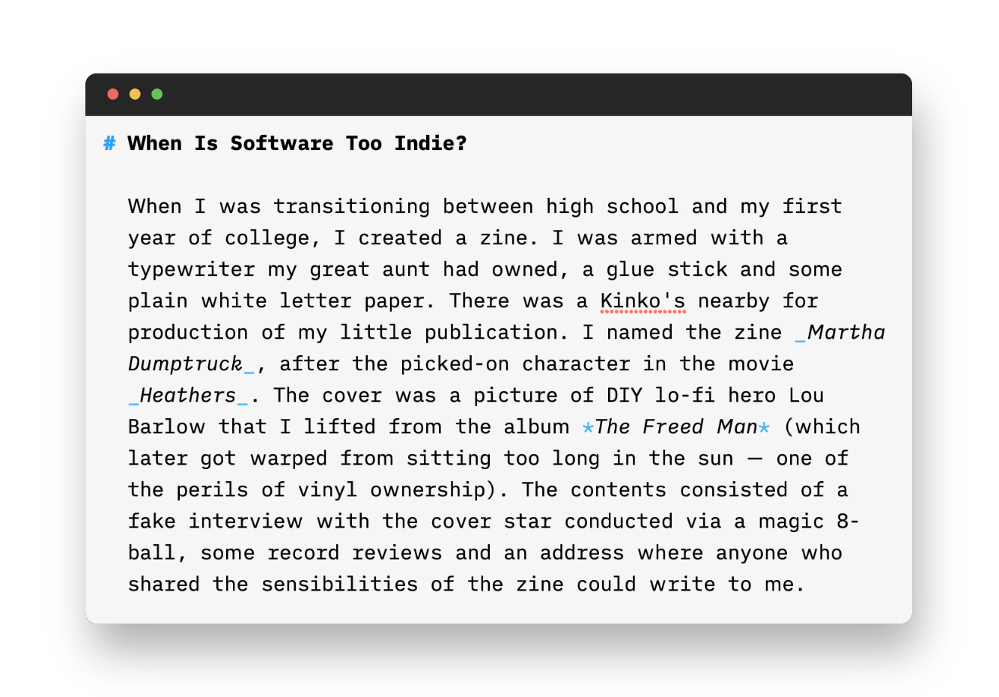

# When Is Software Too Indie?

When I was transitioning between high school and my first year of college, I created a zine. I was armed with a typewriter my great aunt had owned, a glue stick and some plain white letter paper. There was a Kinko's nearby for production of my little publication. I named the zine _Martha Dumptruck_, after the picked-on character in the movie _Heathers_. The cover was a picture of DIY lo-fi hero Lou Barlow that I lifted from the album *The Freed Man* (which later got warped from sitting too long in the sun — one of the perils of vinyl ownership). The contents consisted of a fake interview with the cover star conducted via a magic 8-ball, some record reviews and an address where anyone who shared the sensibilities of the zine could write to me. 

During my second semester of college, I developed a lump in my chest that would initially be dismissed as just my sternum, but would later be diagnosed as lymphoma. I had to start treatment at Duke Medical Center immediately after my diagnosis and drop out of East Carolina University a few weeks short of the end of the semester. Grades had to wait while I got some unwanted free time. I needed something to focus on, other than my cancer treatment. 

During my chemo, I had books to read and records to listen to, but I needed a creative outlet. I turned back to zine making, and produced a second issue of Martha Dumptruck to drop off at record stores. This time, my writing improved a bit (though it was still pretty atrocious). I never got any letters from the people out there who may have picked up a copy of the zine at the record stores where I left it, but it's fair to say I was hooked on self-publishing. When tools for self-publishing on the internet started maturing, I was elated at the ability to easily write for others. Blogger's slogan "push-button publishing" strongly resonated with me. It really was as simple as that. 

The last few years, I've been using the Micro.blog hosted blogging service to publish most of my words. The service has been a great way to write in my app of choice — a bunch of apps on the Mac support publishing to Micro.blog — and get my thoughts out to people who theoretically want to read blog posts. As Micro.blog got more functionality, it became easier to customize your blog and make it your online home. When there were issues, you could reach out to the developer, Manton Reece, and get help. Unfortunately, Micro.blog has grown in functionality, it has also increased in bugs and areas to support. 

Micro.blog is in a difficult place right now. It still only has the one full-time developer, but as it gains in users (particularly in light of the recent changes at Twitter) and has more surface area to support, it's starting to seem like more than one person can handle. However, it's probably not yet in a place where it is bringing in enough revenue to be able to bring in another developer or someone to provide support. 

Late in the summer, I was at the beach and had some time on my hands to fiddle with the theme of my blog (this is what I do when I get a vacation). Unfortunately, I ran into problems with Micro.blog, where CSS variable wouldn't work and my blog ended up in an in-between two themes state and looked pretty janky. I emailed help to see if I could get some assistance on the strange issues. At the same time, I ran into an issue with HEY e-mail where the "focus and reply" functionality would work on my iPad. I emailed HEY at roughly the same time I emailed Micro.blog. I heard back from a super friendly HEY support rep the next day, and the bug was fixed within a week. It was two weeks before I heard anything back from Micro.blog and my issue was unresolved. It still persists to this day, but I've used media queries and hard coded values to work around it in most cases. 

During the past weekend, I ran into a bunch of different bugs in Micro.blog. My newsletter took 11 hours to send. I tried to add my newsletter sign-up to my posts page, and it massively messed up the interface, for no apparent reason. I tried to switch themes to test my changes in another theme, and my blog got stuck in between themes and had elements of both, causing it to look really strange. I tried the new feature to import posts to my blog via RSS from HEY World and the stylesheets on the post didn't work (ultimately, this was an issue with the HTML in the HEY World post).  