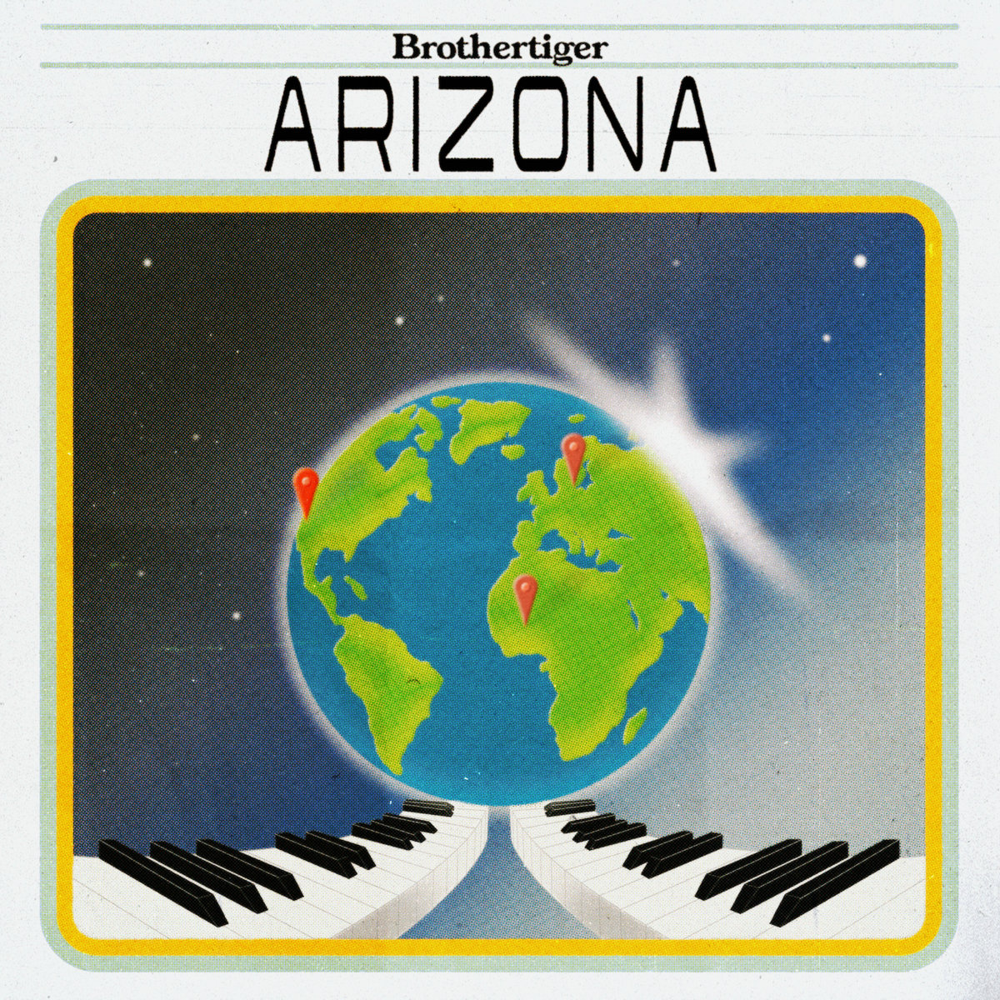

# Brothertiger "Arizona"

Brothertiger comes the closest of any band I can think of in blending a 2010 chillwave aesthetic with 80's sophistipop sensibilities. It's the most obvious on the new *Heaven* EP, which compiles 4 singles that sound like they were recorded together. However, while it doesn't stray too far from the formula of the other songs, Brothertiger's John Jagos describes "Arizona" as being influenced by the early nineties and touring. The video and song paint a picture of the vast desert landscape being punctured at times by the intertwining highways of the city. The freedom of driving in that landscape dominates the lyrics. 

I can't help but be reminded of the few months I lived in Albuquerque in the 11th grade. We would drive off-road in the desert sand to get to school in my friends gas-guzzling Jimmy. Not having to adhere to the designated routes and the city streets was something of an intoxicant that early in the morning. 

https://youtu.be/cpvl02VMJiI