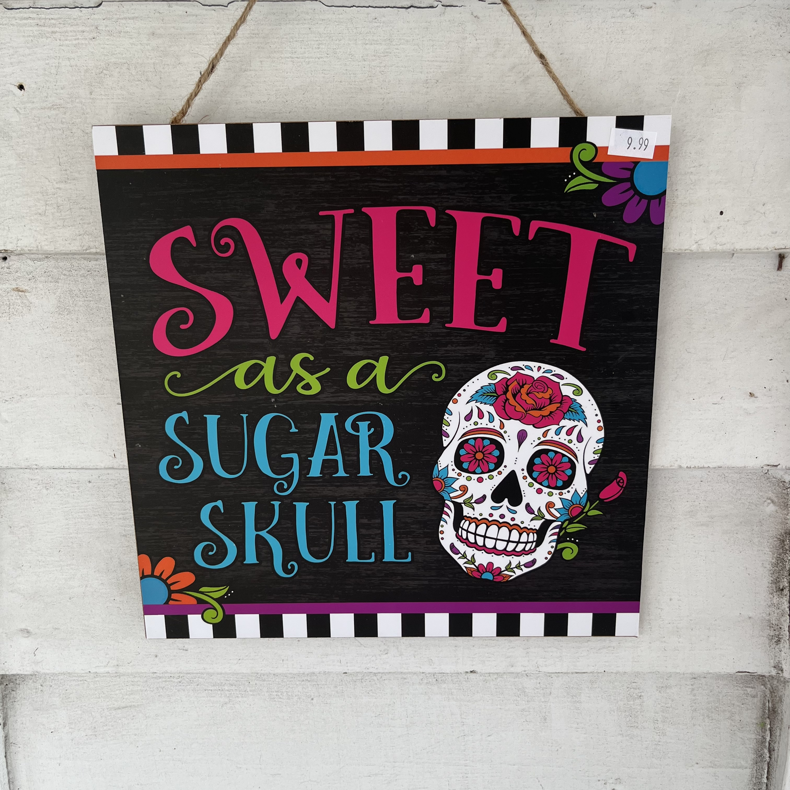

# Now

*Inspired by* *[Derek Silvers](https://sivers.org/nowff)*, *this page includes a sample of what I’m thinking about and working on right now. Last updated August 27, 2022.*

---

I just got back from a vacation near the beach. It was the first time we have gone on vacation as a family since our last beach trip in 2018. Since having a virus in early 2019 and the subsequent post-viral illness that hit me, I've been unable to take planned time off to go somewhere for a couple of reasons.

1. I was simply too ill to travel.
2. I was so unpredictably ill that I had to hold my PTO in reserve for when I was sick. 

I feel bad that my family has been held captive to my illness. Even this year, as I made progress in my recovery, it was difficult to find a time both of my boys were off of school simultaneously, one being on a year-round schedule and the other a traditional schedule. This vacation was a long time in coming and I am most grateful for it. Although, we did have to watch the cloudy skies and check the weather for the duration of trip. We dodged rain drops as we made our way to the Cape Fear River and the Atlantic Ocean. We perused various shops full of knick knacks like crocheted mug cozies, Moon Pie t-shirts, handmade bird houses decorated to look like quaint wine shops and gourmet dog treats that were totally fit for human consumption. 

We didn't actually make it to the beach that often during the trip, and when we did, the sea alternated between brutally choppy and almost impossibly calm. As much as we did, though, there was more we left undone. We never made it to one of our favorite restaurants, Shagger Jack's, and didn't pick up any sweets from the Asian woman who improbably sells fudge and confederate flags (ugh) at a shop called Bubba's. 

Now that we're back home, I have to return my thoughts to things like my oldest son's second half of high school and where I'm going to attend church. I've been writing a bit about my struggles with where to worship in my newsletter and I still haven't come to a conclusion. The denomination that I'm a part of, the Presbyterian Church (USA), has been a progressive church for some time, but lately has taken a real leftward turn. This is increasingly an issue when politics divides our country and the Body of Christ. I just have trouble believing that a church that has been around for 2000 years would come to the same conclusions as modern day secular political party. It strains credulity. At the same time, I'm just as wary, if not more so, of churches that fall on the Evangelical spectrum. The mere fact that many of those churches and their congregations support a villain like our former president tells you a lot of what you need to know about how they follow Jesus. The halls of worldly power are more alluring than the crown of Christ for a lot of people who identify as Christians. 

Once I felt politically homeless and now I'm increasingly feeling spiritually homeless. I had a wonderful talk with my pastor about this, and he seemed to appreciate my concerns. Next, I hope to talk to a priest at the local Orthodox parish about their ancient tradition. 

I'll leave you with some pictures from our recent trip. 

