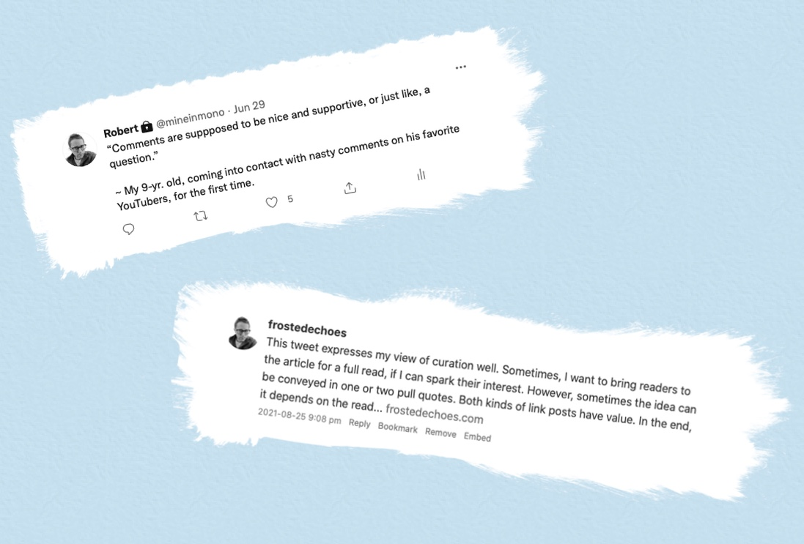

# About

Canned Dragons is a personal web log by a prolific notetaker named [Robert](https://frostedechoes.blot.im/robert-bio). This site follows the [POSSE](https://indieweb.org/POSSE) "Publish (on your) Own Site, Syndicate Elsewhere" model, which is described as “a content publishing model that starts with posting content on your own domain first, then syndicating out copies to 3rd party services with [permashortlinks](https://indieweb.org/permashortlink) back to the original on your site.” 

Before the ascendency of social media, the blogosphere used to be referred, in a derogatory way, as an echo chamber. The "echoes" in the site name refers, in a postive way, to the fact that this blog pulls in thoughts from other independent blogs as well as social media accounts and major publishers. This project is an effort to celebrate the earlier days of blogging.

This site is built with a stack of plain text files, a git repository and <a href="https://blot.im">Blot</a>. 

---

*Icons licensed from Font Awesome under Creative Commons 4.0. Terms can be found [here](https://fontawesome.com/license).*