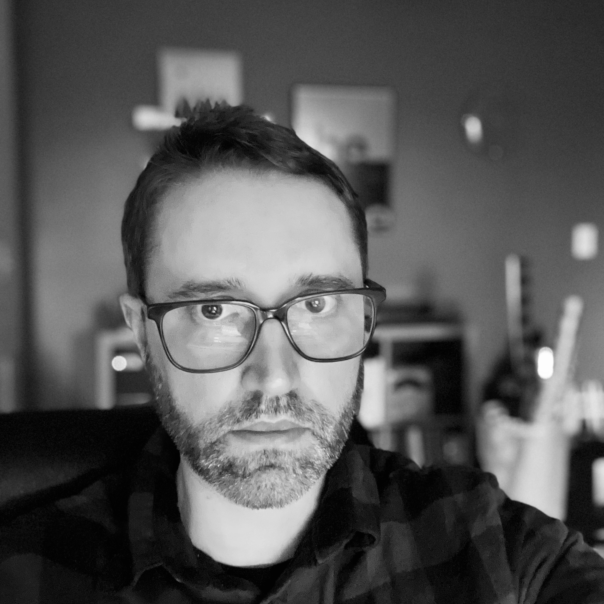

# Author Bio

{>} 

Hey there 👋, I'm Robert. I've been blogging for years and have tried just about all of the platforms out there. I blog about faith from a countercultural Christian perspective, noise (mostly dreampop) and the effects of technology on our lives. I realize the overlap in the venn diagram of my topics may be kind of small, so please feel free to checkout the tags on my site to find whatever interests you. 

My degree is in psychology with a focus on family and child counseling, but I work as a manger of software engineering.  I'm a cancer survivor living with post-viral illness (but getting much better). 

