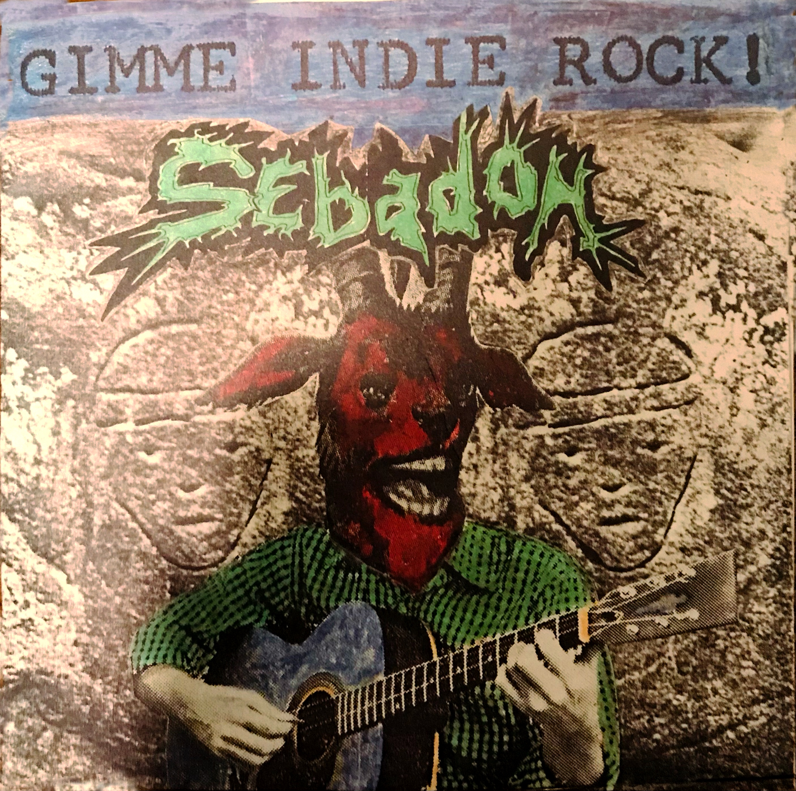

# Gimmie Indie Rock

{{entry.metadata.summary}}

Garrett Martin [writes for Paste Magazine][1] about the seminal year for indie rock that was 1995 and the top 20 albums in the loosely knit genre from that year.
{{more}}
> After a brief period where the distinction between major labels and indie labels blurred, the value and significance of independent music became clear again. Indie labels gave both musicians and fans a legitimate alternative to the bland, cookie-cutter rock music that had taken over MTV programming and alternative radio station playlists by the start of 1995. That freedom resulted in an unusually fruitful year in 1995, with some of the best bands of the era releasing some of their best music.   

That year looms particularly large in my memory because it contained the latter half of my first year of college and a battle with cancer. The nostalgia factor from this piece almost gives me goosebumps. I either owned or borrowed most of these albums in 1995. Of particular importance to me were *Wowee Zowee*, *The Dirt of Luck*, *Get Lost*, *Me Me Me* and *Electr-O-Pura*. I had *Wild Love* by Smog, but couldn’t process its darkness through the ordeal of my cancer diagnosis and treatment.

When Martin writes about the acts from Lollapalooza that year, I remember having to make the tough choice to see Built To Spill on the side stage instead of Beck on the main stage. To this day I've never seen Beck play. I've seen Built to Spill several times, but I've never regretted choosing what was one of my favorite bands at the time. Local heroes Superchunk joined Built to Spill on the side stage and were hyper enough to get the crowd going.

<iframe style="border: 0; width: 100%; height: 120px;" src="https://bandcamp.com/EmbeddedPlayer/album=4163826874/size=large/bgcol=ffffff/linkcol=e99708/tracklist=false/artwork=small/track=141410710/transparent=true/" seamless><a href="https://superchunk.bandcamp.com/album/heres-where-the-strings-come-in-remastered">Here&#39;s Where the Strings Come In (Remastered) by Superchunk</a></iframe>

Due to my cancer treatment, my dad was able to wrangle me seats in the handicapped section, which was pretty close to the main stage. Pavement played a bit later on in the day, and for that we took seats near the front (though not in the handicapped section). The PA's were blasting electronic music when the band came out and lead malkmusician Steve Malkmus strode up to the microphone and promptly said, "turn that sh*t off." It would be years and a life lived in Berlin later that would finally bring him around to that genre. It was a good show, though Pavement was never the tightest live band. 

<iframe style="border: 0; width: 100%; height: 120px;" src="https://bandcamp.com/EmbeddedPlayer/album=3991572627/size=large/bgcol=ffffff/linkcol=0687f5/tracklist=false/artwork=small/track=3877440117/transparent=true/" seamless><a href="https://pavement.bandcamp.com/album/wowee-zowee">Wowee Zowee by Pavement</a></iframe>

I spent a lot of time reading that summer. There wasn't much else to keep me occupied and the internet had not yet become ubiquitous. One of my favorite reading experiences was poring through A Prayer for Owen Meany. It reminded me that even adversity has a purpose in life and helped strengthen my budding faith. My then ex-girlfriend from high school (now wife) has recommended it and had a passion for John Irving novels. I remember the Magnetic Fields' Get Lost LP being the soundtrack to much of that reading. That was a recommendation from my best friend, who later conversed with the Fields' mastermind, Stephin Merritt, on the subject of crying.

<iframe style="border: 0; width: 100%; height: 120px;" src="https://bandcamp.com/EmbeddedPlayer/album=1294509798/size=large/bgcol=ffffff/linkcol=333333/tracklist=false/artwork=small/track=3780987314/transparent=true/" seamless><a href="https://themagneticfields.bandcamp.com/album/get-lost">Get Lost by The Magnetic Fields</a></iframe>

It's taken for granted that any time spent with cancer and scorched earth chemotherapy is going to be tough, but I'll always remember that as one of my favorite summers. Music from that time of my life is still the surest way to bring back memories of 1995.

[1]: https://www.pastemagazine.com/music/indie-rock/best-indie-rock-albums-of-1995/