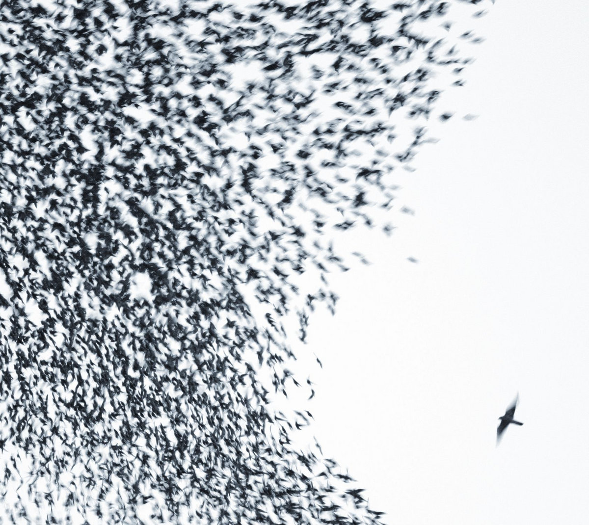

# The Great Pitchfork Apology

Pitchfork [recently revised ratings](https://pitchfork.com/features/lists-and-guides/pitchfork-reviews-rescored/) on 20 albums from the past. They mostly raised scores, but also lowered some, as well. 

Freddie Deboer is [having none of it](https://freddiedeboer.substack.com/p/the-problem-with-liz-phairs-self). 

> Which they are very close to explicitly admitting is the point: not that there was some deficiency in how the original scores were awarded, but rather that the scores look less like what a cool person thinks now. One little snippet helpfully points out that liking an artist was not cool when the review was written but is cool now; honest, but perhaps this should have been removed in the editing process!

