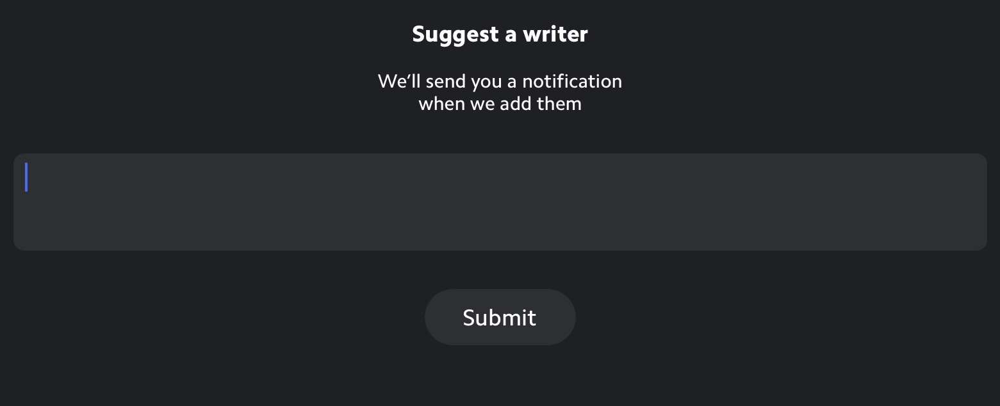

# What Is The Matter?

[Matter][1] is a promising new read-it-later service that shies away from convention and introduces new ideas into a space already occupied by some heavyweight services. I can say, after only playing around with it for a short time, it handles highlighting the best of any service I've used.[^2] However, like a lot of opinionated software, you have to buy into the premises on which its based. One of Matter's most prominent value propositions is that it is based around individuals, rather than publications. It's a direction that's not too far from the one [Medium is taking](https://link.medium.com/crRzVz0Nbkb) (which looks pretty cool). This approach is front and center in the Matter introductory email.

{{more}}

> Matter is the only reading app that gives you one feed of all your favorite writers, from national columnists to indy bloggers to Substacks.

> Why are we designed around writers? Because we think the best indicator of an article's quality is who wrote it, not where it's published.

It's another blow to traditional journalism and the gatekeepers thereof. The implementation in Matter is problematic, though. Despite the language used in the above statement, the assumption is that individuals use email newsletters. There is no way to subscribe to RSS feeds from within the app. 

To add an author, you get an indication that you are adding and RSS feed (even using the universally recognized RSS icon). However, this is what you get when you try to add a feed from a writer. 

Reading between the lines, I can only come to the conclusion that they believe RSS is for publications and newsletters are for individuals. Certainly, the much written-about defection of major writers from traditional publications to their own Substack newsletters has to be informing this view. Individual writers have blogs, as well, though, and those blogs are still best followed through RSS.

You can easily add newsletters to Matter. The result is that you have direct access to writers through their newsletters, but Matter serves as a gatekeeper for other forms of distribution. I don't know what criteria gets you added to the Matter list of authors, but ultimately it seems like just another group of editors deciding whose work gets put out there. *So much for the democratization power of the internet.*

---

*If you are interested in Matter, Matt Birchler has [a more comprehensive evaluation](https://youtu.be/Fa-r-b_s8gc) on his YouTube channel, A Better Computer. *

[1]: https://getmatter.app/
[^2]: Which is certainly one of the most important features in a read-it-later app. 